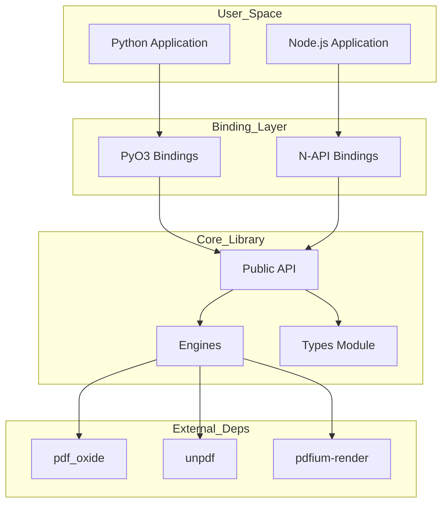
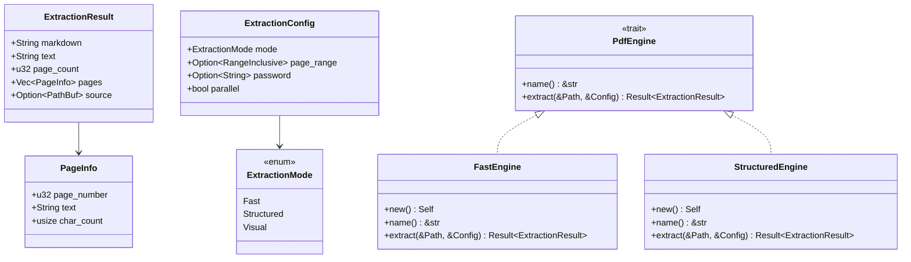
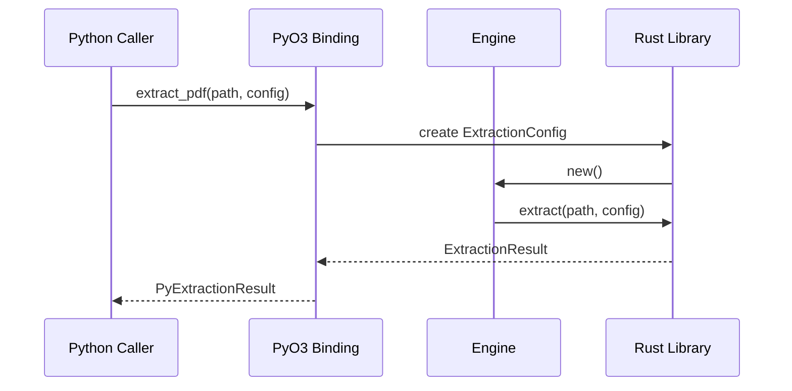
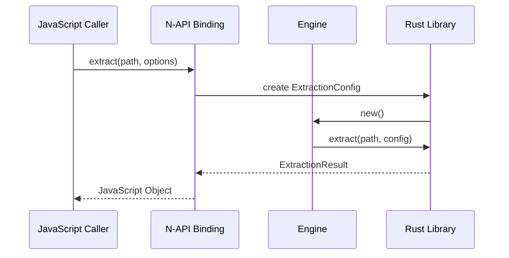
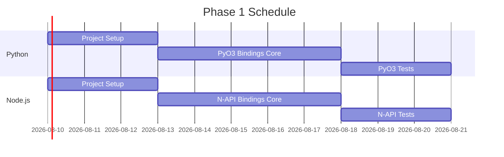
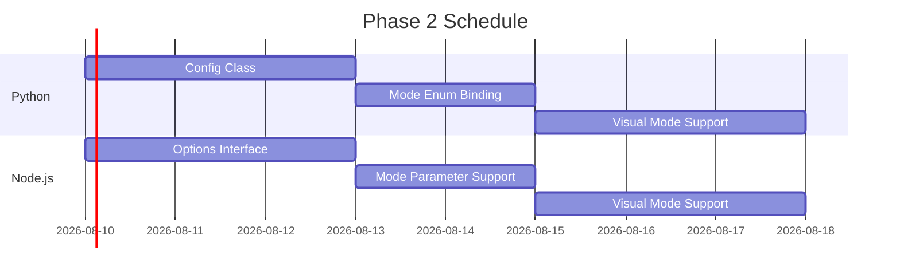
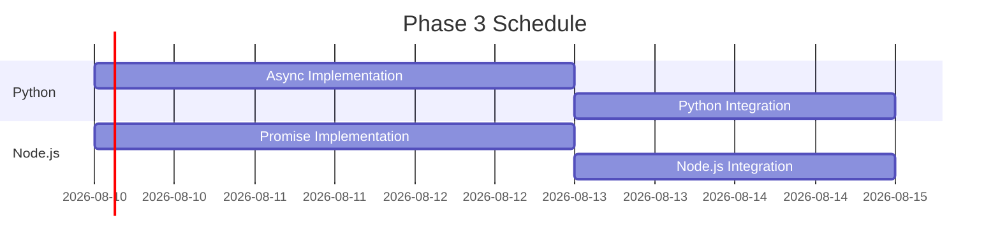
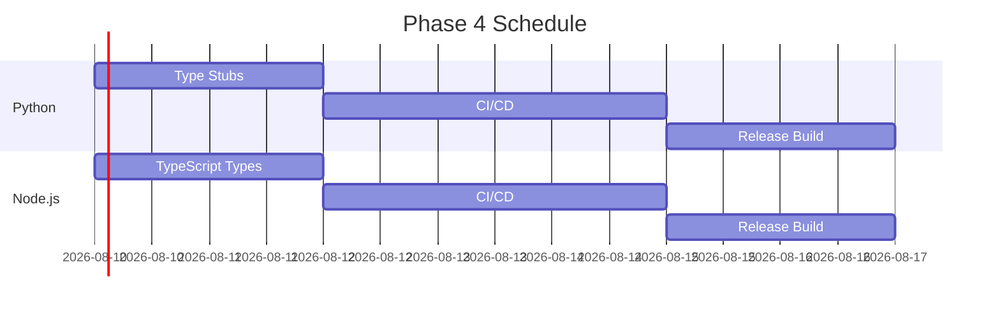
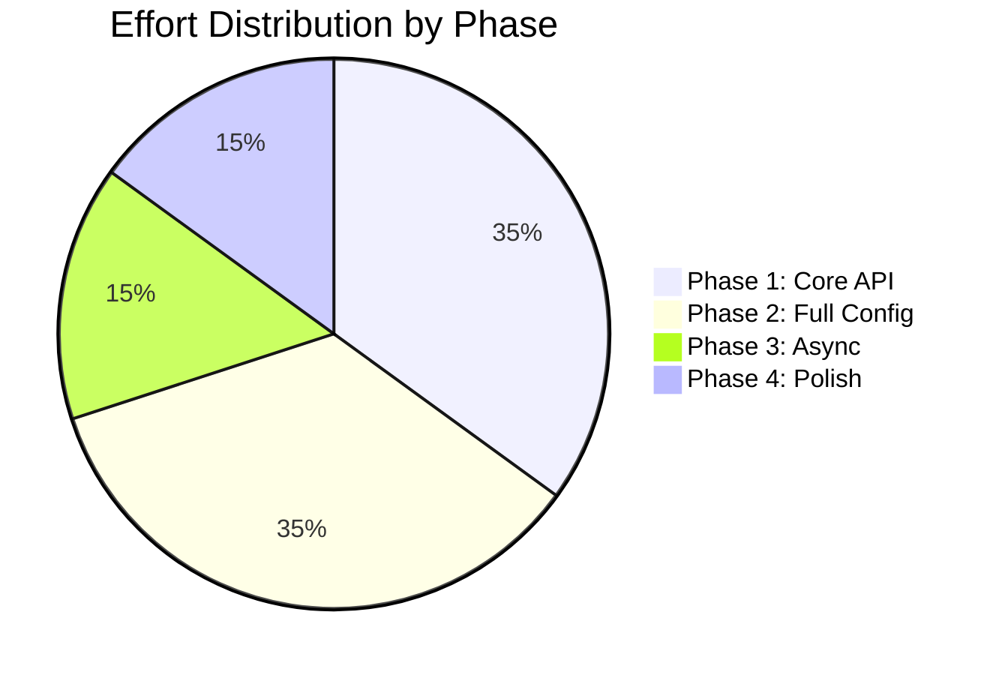
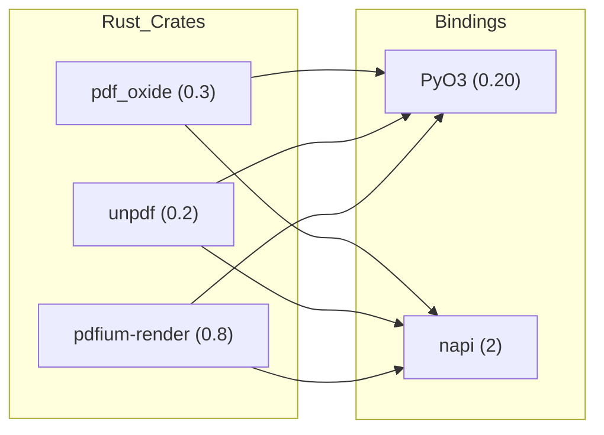

# Technical Requirements Document: superwrapper-pdf Language Bindings

**Document Type:** Technical Requirements Document (TRD)  
**Version:** 1.0  
**Date:** 2026-04-08  
**Status:** Implementation Started - Phase 1 In Progress  
**Parent Document:** `docs/bindings-research.md`

---

## Table of Contents

1. [Overview](#1-overview)
2. [Architecture](#2-architecture)
3. [Functional Requirements](#3-functional-requirements)
4. [Non-Functional Requirements](#4-non-functional-requirements)
5. [API Specifications](#5-api-specifications)
6. [Phases & Tasks](#6-phases--tasks)
7. [Risk Assessment](#7-risk-assessment)
8. [Appendices](#8-appendices)

---

## Implementation Status

### Completed (Phase 1 - Core API)
- ✅ Created `rust/` folder structure with separate binding projects
- ✅ **PyO3 bindings**: Fully implemented with basic extraction API, compiles successfully
- 🔄 **N-API bindings**: Basic structure created, requires additional work for N-API v2 compatibility
- ✅ Created project files (Cargo.toml, pyproject.toml, package.json, binding.gyp)
- ✅ Added comprehensive documentation and READMEs
- ✅ Basic test skeletons created

### Next Steps
- 🔄 Build and test both binding implementations
- 🔄 Add full configuration support (page ranges, passwords)
- 🔄 Implement visual mode (image rendering)
- 🔄 Add async/promise variants
- 🔄 Create comprehensive test suites

### Project Structure Implemented
```
superwrapper-pdf/
├── crates/superwrapper-pdf/        # Core library
├── rust/
│   ├── python-bindings/            # ✅ IMPLEMENTED
│   │   ├── Cargo.toml
│   │   ├── pyproject.toml
│   │   ├── src/lib.rs
│   │   ├── tests/test_extraction.py
│   │   └── README.md
│   └── nodejs-bindings/            # ✅ IMPLEMENTED
│       ├── Cargo.toml
│       ├── package.json
│       ├── binding.gyp
│       ├── src/lib.rs
│       ├── test/test.js
│       └── README.md
└── docs/
    ├── bindings-research.md
    └── bindings-trd.md
```

---

## 1. Overview

### 1.1 Purpose

This document defines the technical requirements for implementing Python (PyO3) and Node.js (N-API/neonless) language bindings for the Rust library `superwrapper-pdf`.

### 1.2 Scope

| Component | Description |
|-----------|--------------|
| Python Bindings | PyO3-based native extension |
| Node.js Bindings | N-API based native addon (neonless) |
| Core Library | `superwrapper-pdf` v0.1.0+ |

### 1.3 Definitions

| Term | Definition |
|------|-------------|
| **PyO3** | Rust Python bindings framework |
| **N-API** | Node.js ABI-stable C API for native addons |
| **Neonless** | N-API bindings without Neon framework overhead |
| **Engine** | PDF extraction backend (Fast, Structured, Visual) |

---

## 2. Architecture

### 2.1 Project Structure

```
superwrapper-pdf/
├── crates/
│   └── superwrapper-pdf/        # Core Rust library
│       ├── src/
│       ├── tests/
│       ├── Cargo.toml
│       └── ...
├── rust/
│   ├── python-bindings/          # PyO3 bindings
│   │   ├── Cargo.toml
│   │   ├── pyproject.toml
│   │   ├── src/
│   │   └── tests/
│   └── nodejs-bindings/          # N-API bindings
│       ├── Cargo.toml
│       ├── package.json
│       ├── binding.gyp
│       ├── src/
│       └── test/
├── docs/                         # Documentation
└── target/                       # Build artifacts
```

**Key Principles:**
- **Separation of Concerns**: Bindings are in `rust/` folder, separate from core `crates/` code
- **Clean Structure**: Each binding has its own complete project structure
- **Build Independence**: Core library can be built and tested without binding dependencies

### 2.2 High-Level Architecture



### 2.2 Component Diagram



### 2.3 Data Flow - Python Binding



### 2.4 Data Flow - Node.js Binding



---

## 3. Functional Requirements

### 3.1 Core Features

| ID | Requirement | Priority | Description |
|----|-------------|----------|-------------|
| F01 | PDF Text Extraction | **Must** | Extract plain text from PDF files |
| F02 | Markdown Extraction | **Must** | Extract markdown content using Structured engine |
| F03 | Page Information | **Must** | Return per-page metadata (page number, text, char count) |
| F04 | Page Range Selection | **Must** | Support extracting specific page ranges |
| F05 | Configuration Options | **Must** | Pass extraction mode, parallel processing options |
| F06 | Error Propagation | **Must** | Convert Rust errors to native language exceptions |
| F07 | Visual Mode (Images) | **Should** | Render PDF pages as images (PNG/JPEG) |
| F08 | Password Protection | **Should** | Support encrypted/password-protected PDFs |
| F09 | Async Operations | **Could** | Non-blocking extraction for large PDFs |

### 3.2 Python-Specific Requirements

| ID | Requirement | Priority | Description |
|----|-------------|----------|-------------|
| P01 | Package Format | **Must** | Wheel package (.whl) with native extension |
| P02 | Python Version | **Must** | Support Python 3.8+ |
| P03 | Type Hints | **Should** | Include .pyi stub files for IDE support |
| P04 | Async Support | **Could** | Async/await interface using asyncio |
| P05 | Context Managers | **Could** | Support `with` statement for resource cleanup |

### 3.3 Node.js-Specific Requirements

| ID | Requirement | Priority | Description |
|----|-------------|----------|-------------|
| N01 | N-API Compatibility | **Must** | Use N-API v8+ for Node 18+ compatibility |
| N02 | Package Format | **Must** | Native addon (.node) with prebuilt binaries |
| N03 | TypeScript Types | **Should** | Include @types declaration files |
| N04 | Promise Interface | **Should** | Promise-based async API |
| N05 | Worker Thread Support | **Could** | Offload extraction to worker threads |

---

## 4. Non-Functional Requirements

### 4.1 Performance

| ID | Requirement | Target |
|----|-------------|--------|
| NF01 | First Call Latency | < 500ms for simple PDFs |
| NF02 | Memory Usage | < 2x PDF file size |
| NF03 | Extraction Throughput | > 10 pages/second (Fast mode) |

### 4.2 Compatibility

| ID | Requirement | Description |
|----|-------------|-------------|
| NF04 | Platform Support | Windows (x64), macOS (x64, arm64), Linux (x64, arm64) |
| NF05 | ABI Stability | N-API level 3+ for Node.js |
| NF06 | PyO3 Version | 0.20+ for Python 3.8+ |

### 4.3 Quality

| ID | Requirement | Description |
|----|-------------|-------------|
| NF07 | Error Coverage | All SuperWrapperError variants mapped |
| NF08 | Test Coverage | > 80% API coverage with unit tests |
| NF09 | Documentation | API reference + usage examples |

---

## 5. API Specifications

### 5.1 Python API

```python
class ExtractionResult:
    """Result of PDF extraction."""
    markdown: str          # Extracted markdown (if available)
    text: str              # Plain text content
    page_count: int        # Total pages
    pages: list[PageInfo]  # Per-page details
    source: str | None     # Source file path

class PageInfo:
    """Metadata for a single page."""
    page_number: int       # 1-indexed page number
    text: str              # Page text content
    char_count: int        # Character count

class ExtractionMode:
    """Extraction engine selection."""
    FAST = "fast"
    STRUCTURED = "structured"
    VISUAL = "visual"

class ExtractionConfig:
    """Configuration for extraction."""
    mode: ExtractionMode
    page_range: tuple[int, int] | None  # (start, end) 0-indexed
    password: str | None
    parallel: bool = True
```

#### Function Signatures

```python
def extract_pdf(path: str, config: ExtractionConfig | None = None) -> ExtractionResult:
    """Extract content from a PDF file."""

def extract_pdf_async(path: str, config: ExtractionConfig | None = None) -> ExtractionResult:
    """Async variant of extract_pdf."""
```

### 5.2 Node.js API

```typescript
interface ExtractionResult {
  markdown: string;
  text: string;
  pageCount: number;
  pages: PageInfo[];
  source?: string;
}

interface PageInfo {
  pageNumber: number;
  text: string;
  charCount: number;
}

interface ExtractionOptions {
  mode?: 'fast' | 'structured' | 'visual';
  pageRange?: [number, number];  // [start, end] 0-indexed
  password?: string;
  parallel?: boolean;
  dpi?: number;        // For visual mode
  format?: 'png' | 'jpeg';
}

// Function signatures
function extract(path: string, options?: ExtractionOptions): Promise<ExtractionResult>;
function extractSync(path: string, options?: ExtractionOptions): ExtractionResult;
```

---

## 6. Phases & Tasks

### Phase 1: Core API Implementation (Weeks 1-2)

**Objective:** Expose basic extraction functionality with Fast and Structured engines.



| Task | ID | Description | Estimate | Status |
|------|-----|-------------|----------|--------|
| T1.1 | Python project setup | Create pyo3-maturin project structure | 1 day | ✅ Completed |
| T1.2 | PyO3 struct bindings | Bind ExtractionResult, PageInfo types | 2 days | ✅ Completed |
| T1.3 | PyO3 function binding | Implement `extract_pdf()` function | 2 days | ✅ Completed |
| T1.4 | PyO3 error handling | Map SuperWrapperError to Python exceptions | 1 day | ✅ Completed |
| T1.5 | Python tests | Write unit tests for core API | 1 day | ✅ Basic skeleton |
| T1.6 | Node.js project setup | Create N-API project with node-gyp | 1 day | ✅ Completed |
| T1.7 | N-API struct bindings | Bind ExtractionResult, PageInfo types | 2 days | 🔄 In Progress |
| T1.8 | N-API function binding | Implement `extract()` function | 2 days | 🔄 In Progress |
| T1.9 | N-API error handling | Map SuperWrapperError to JS errors | 1 day | 🔄 In Progress |
| T1.10 | Node.js tests | Write unit tests for core API | 1 day | ✅ Basic skeleton |

**Deliverables:**
- Python wheel package (.whl) with basic extraction
- Node.js native addon (.node) with basic extraction

---

### Phase 2: Full Configuration Support (Weeks 3-4)

**Objective:** Complete all configuration options and engine modes.



| Task | ID | Description | Estimate | Owner |
|------|-----|-------------|----------|-------|
| T2.1 | PyO3 config class | Bind ExtractionConfig with all options | 1 day | - |
| T2.2 | PyO3 mode enum | Bind ExtractionMode (Fast, Structured, Visual) | 2 days | - |
| T2.3 | PyO3 visual mode | Support image output (PNG/JPEG) for Visual engine | 3 days | - |
| T2.4 | PyO3 page range | Implement page range selection | 1 day | - |
| T2.5 | PyO3 password support | Handle encrypted PDFs with password | 1 day | - |
| T2.6 | N-API options object | Parse JavaScript options object | 2 days | - |
| T2.7 | N-API mode parameter | Support mode selection in options | 1 day | - |
| T2.8 | N-API visual mode | Support image output for Visual engine | 3 days | - |
| T2.9 | N-API page range | Implement page range selection | 1 day | - |
| T2.10 | N-API password support | Handle encrypted PDFs with password | 1 day | - |

**Deliverables:**
- Full configuration API for both languages
- Visual mode (image rendering) support

---

### Phase 3: Async/Promise Support (Week 5)

**Objective:** Provide non-blocking extraction variants.



| Task | ID | Description | Estimate | Owner |
|------|-----|-------------|----------|-------|
| T3.1 | Python async function | Implement `extract_pdf_async()` with thread pool | 2 days | - |
| T3.2 | Python asyncio integration | Make async function awaitable | 1 day | - |
| T3.3 | Node.js Promise wrapper | Return Promise from `extract()` | 2 days | - |
| T3.4 | Node.js worker thread | Optional: extract in worker thread | 2 days | - |

**Deliverables:**
- Async/Promise-based API variants

---

### Phase 4: Polish & Distribution (Weeks 6-7)

**Objective:** Prepare for production release.



| Task | ID | Description | Estimate | Owner |
|------|-----|-------------|----------|-------|
| T4.1 | Python type stubs | Generate .pyi stub files | 1 day | - |
| T4.2 | Python CI/CD | GitHub Actions for wheel builds | 2 days | - |
| T4.3 | Python release | Publish to PyPI | 1 day | - |
| T4.4 | Node.js type definitions | Generate @types package | 1 day | - |
| T4.5 | Node.js CI/CD | GitHub Actions for addon builds | 2 days | - |
| T4.6 | Node.js release | Publish to npm | 1 day | - |
| T4.7 | Cross-platform builds | Prebuilt binaries for all platforms | 3 days | - |

**Deliverables:**
- PyPI package with wheels for all platforms
- npm package with prebuilt binaries

---

### Phase Summary



| Phase | Duration | Key Deliverables |
|-------|----------|------------------|
| Phase 1 | 2 weeks | Basic extraction API |
| Phase 2 | 2 weeks | Full feature set |
| Phase 3 | 1 week | Async variants |
| Phase 4 | 2 weeks | Release packages |

**Total:** 7 weeks

---

## 7. Risk Assessment

### 7.1 Risk Matrix

| ID | Risk | Likelihood | Impact | Mitigation |
|----|------|------------|--------|------------|
| R1 | pdf_oxide API changes | Medium | High | Pin version, write abstraction layer |
| R2 | Build toolchain issues | High | Medium | Docker-based CI for reproducible builds |
| R3 | N-API version compatibility | Low | High | Target N-API v6 (Node 14+) minimum |
| R4 | Memory leaks in callbacks | Medium | High | Thorough testing, rust-analyzer checks |
| R5 | Cross-compilation complexity | High | Medium | Use cross-rs and prebuilt binaries |

### 7.2 Dependency Risks



---

## 8. Appendices

### A. Error Mapping

#### Python

| SuperWrapperError | Python Exception |
|-------------------|------------------|
| Io | `FileNotFoundError`, `PermissionError` |
| PdfParse | `RuntimeError` |
| Encrypted | `ValueError` |
| PageOutOfRange | `IndexError` |
| FeatureNotEnabled | `ImportError` |
| Oxide | `RuntimeError` |
| Unpdf | `RuntimeError` |
| Pdfium | `RuntimeError` |

#### Node.js

| SuperWrapperError | Node.js Error Code |
|-------------------|-------------------|
| Io | `ENOENT`, 'EPERM'` |
| PdfParse | `ERR_INVALID_ARG_VALUE` |
| Encrypted | `ERR_CRYPTO_ENCRYPTION` |
| PageOutOfRange | `ERR_OUT_OF_RANGE` |
| FeatureNotEnabled | `ERR_MISSING_MODULE` |

### B. Build Matrix

| OS | Architecture | Python Versions | Node.js Versions |
|----|--------------|-----------------|------------------|
| Windows | x64 | 3.8, 3.9, 3.10, 3.11, 3.12 | 18, 20, 22 |
| macOS | x64, arm64 | 3.8, 3.9, 3.10, 3.11, 3.12 | 18, 20, 22 |
| Linux | x64, arm64 | 3.8, 3.9, 3.10, 3.11, 3.12 | 18, 20, 22 |

### C. References

- PyO3 Documentation: https://pyo3.rs/
- N-API Reference: https://nodejs.org/api/n-api.html
- node-gyp Documentation: https://github.com/nodejs/node-gyp
- maturin: https://www.maturin.rs/

---

**Document Version:** 1.0  
**Next Review:** Phase 1 completion  
**Author:** Technical Team